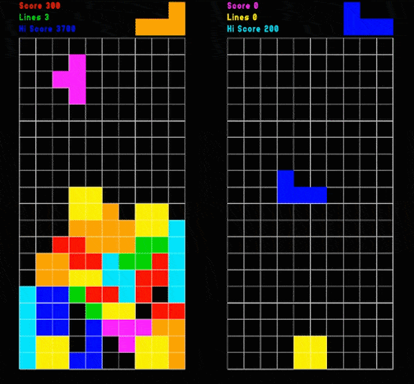
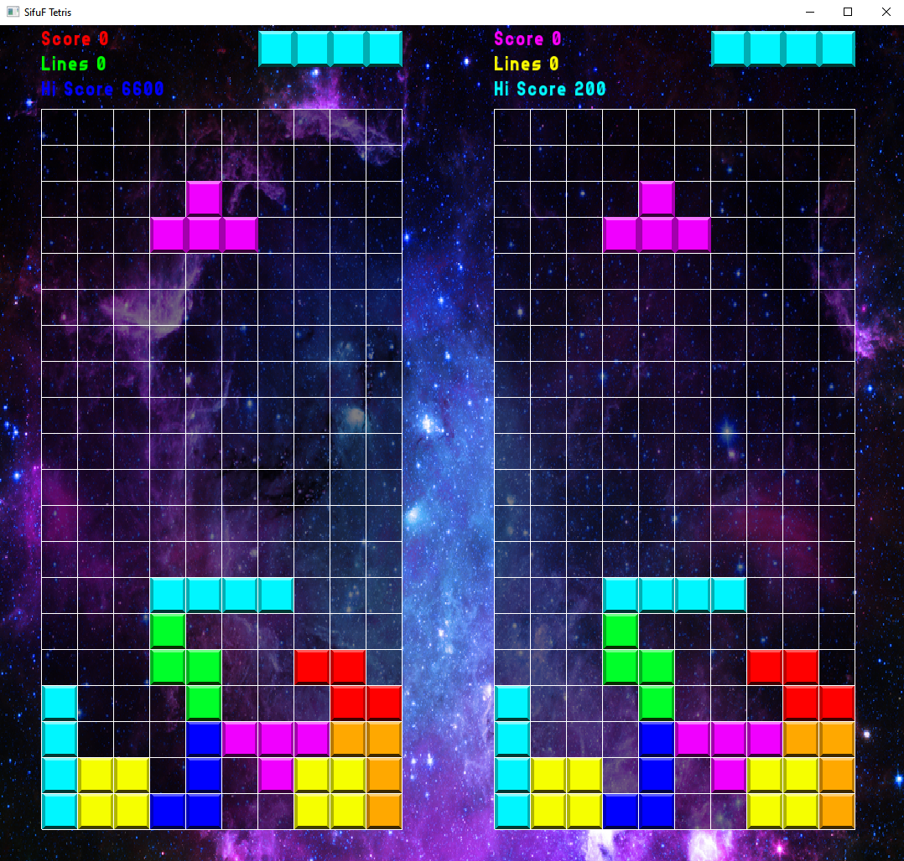
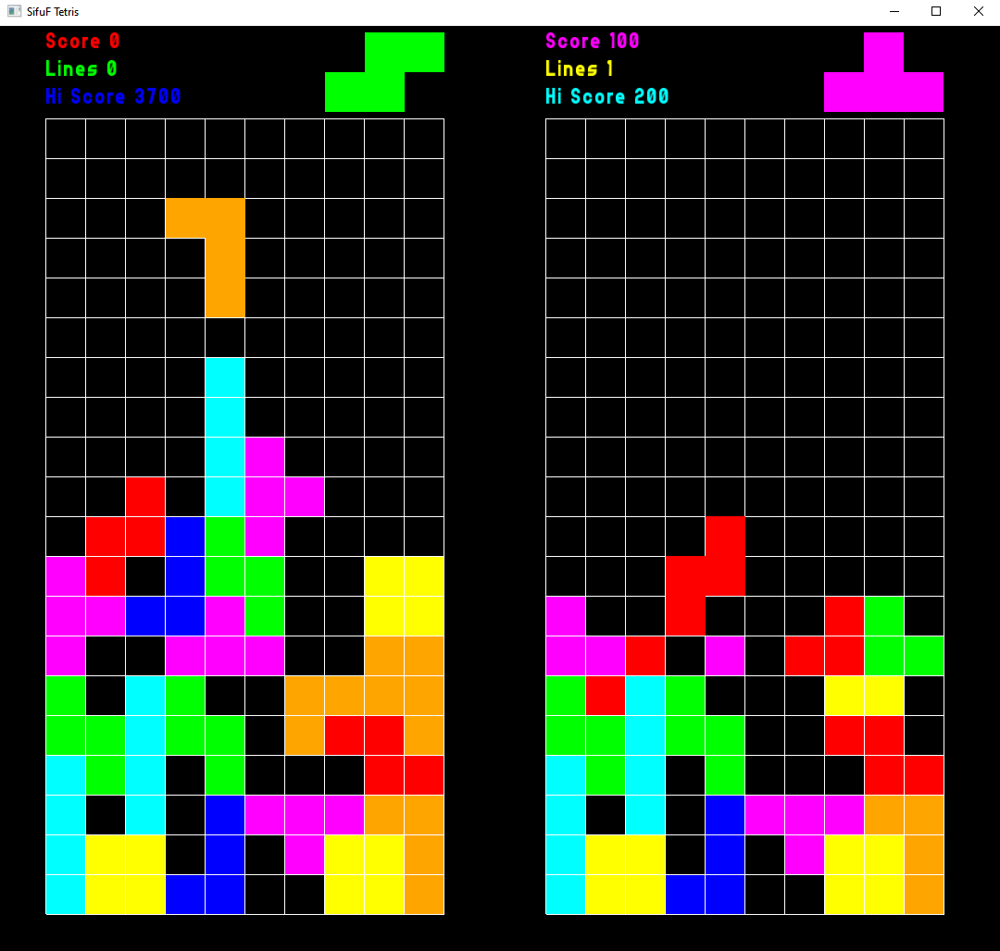

# Space Tetris
Two player vs battle Tetris game



[Click here for video](img/tetris.mp4)

## Build
```
git submodule update --init
mkdir build && cd build
cmake ..
cmake --build .
```
## Controls
```
Left player:
  Left/Right: A/D
  Rotate : W
  Drop : S

Right player:
  Left/Right: Left/Right arrow keys
  Rotate : Up arrow key
  Drop : Down arrow key

```



configure with ```cmake -DGRAPHICS=OFF ..``` for barebones look:


